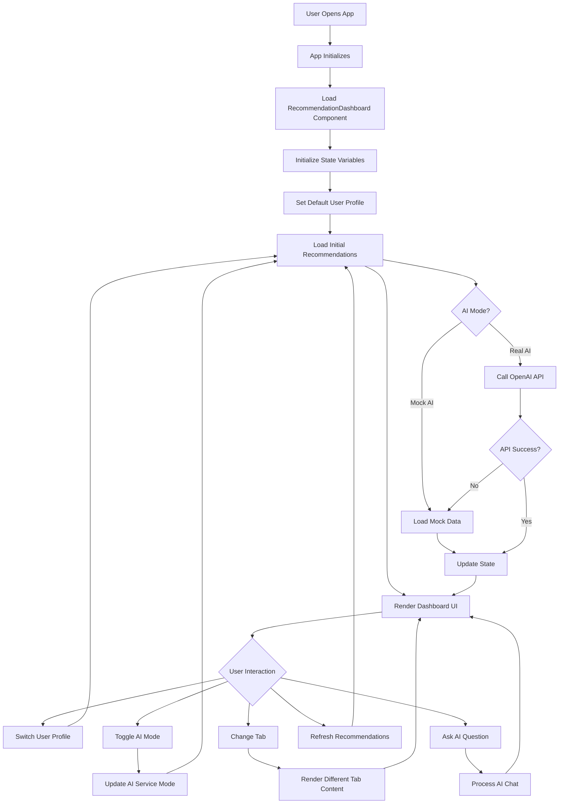
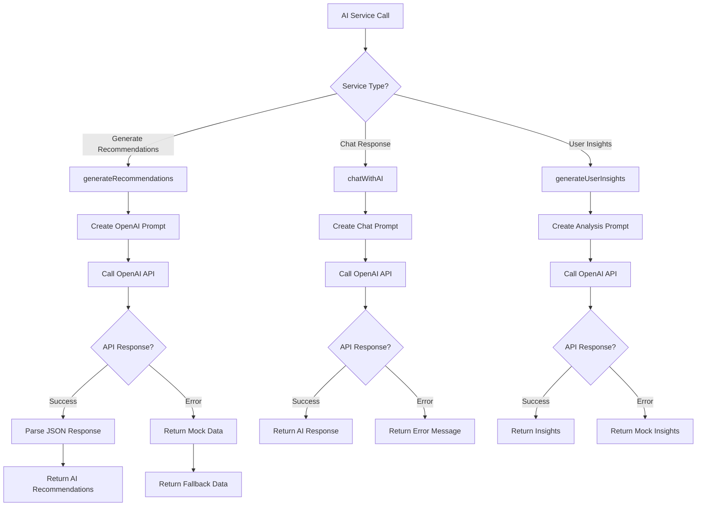
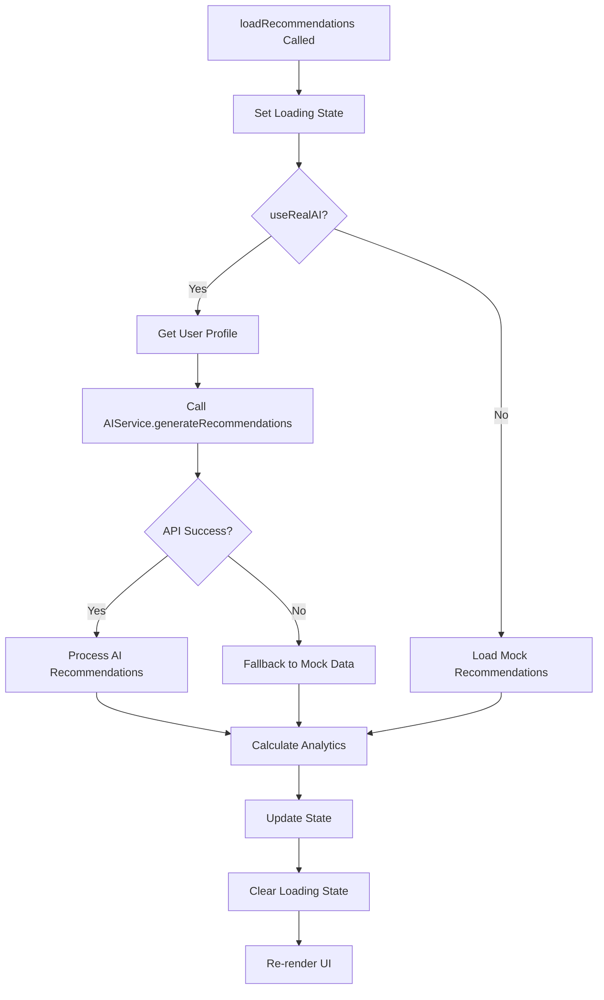
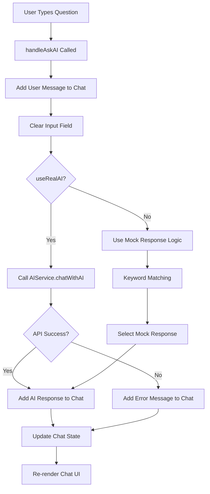
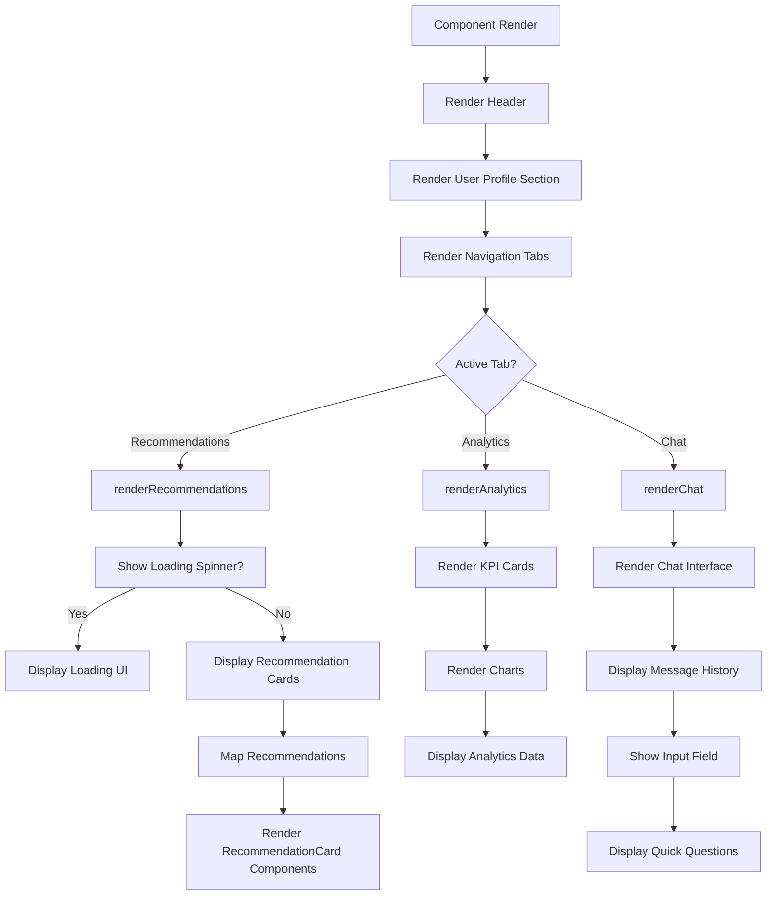
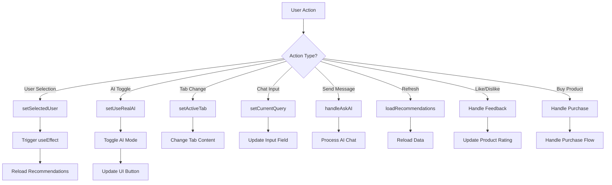
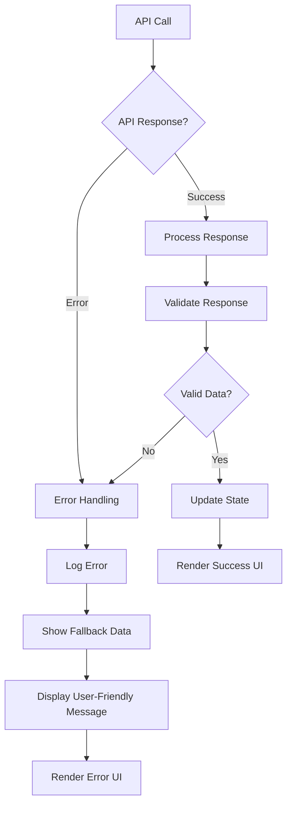
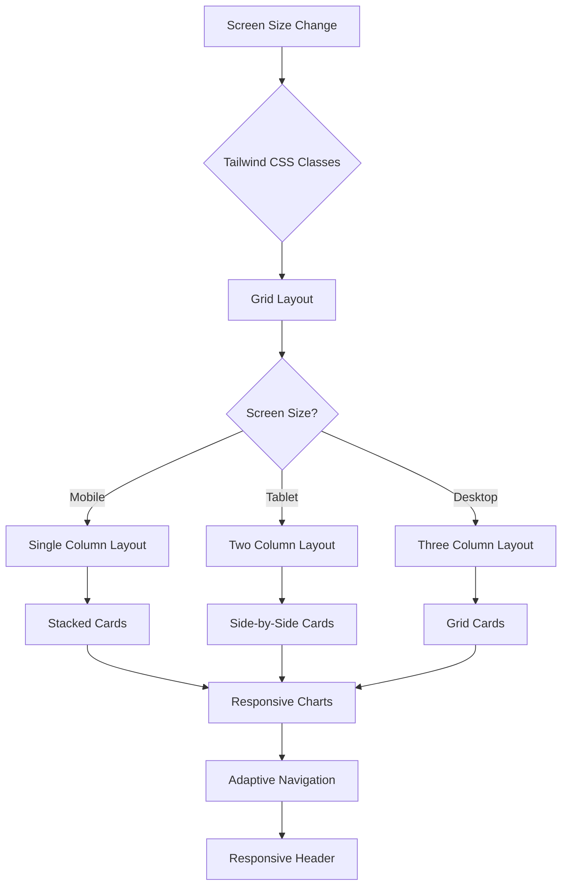
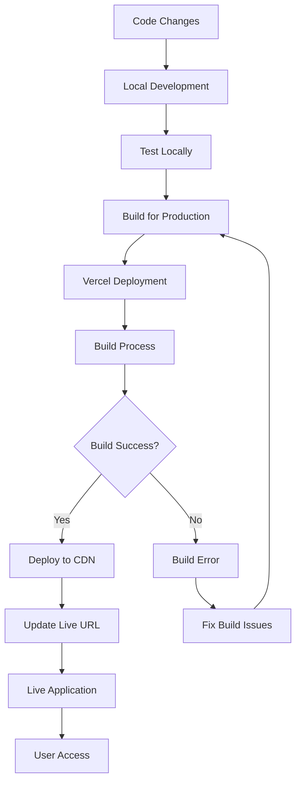

# 🔄 AI Recommendation Dashboard - Code Flow

## 📊 **Main Application Flow**



## 🧠 **AI Service Flow**



## 🎯 **Recommendation Loading Flow**



## 💬 **AI Chat Flow**



## 🎨 **UI Rendering Flow**



## 🔄 **State Management Flow**

```mermaid
flowchart TD
    A[Component State] --> B[recommendations]
    A --> C[analytics]
    A --> D[selectedUser]
    A --> E[loading]
    A --> F[chatMessages]
    A --> G[currentQuery]
    A --> H[activeTab]
    A --> I[useRealAI]
    
    B --> J[AIRecommendation[]]
    C --> K[Analytics Object]
    D --> L[User ID Number]
    E --> M[Boolean Loading State]
    F --> N[Chat Message Array]
    G --> O[Current Input String]
    H --> P[Active Tab String]
    I --> Q[AI Mode Boolean]
    
    J --> R[Product Recommendations]
    K --> S[Performance Metrics]
    L --> T[User Profile Selection]
    M --> U[Loading UI Control]
    N --> V[Chat History]
    O --> W[Input Field Value]
    P --> X[Tab Content Display]
    Q --> Y[AI Service Mode]
```

## 🎯 **User Interaction Flow**



## 🔧 **Error Handling Flow**



## 📱 **Responsive Design Flow**



## 🚀 **Deployment Flow**



---

## 🎯 **Key Integration Points**

1. **React Hooks** - Manage component state and side effects
2. **TypeScript** - Type safety and better development experience
3. **Tailwind CSS** - Responsive styling and modern UI
4. **Recharts** - Data visualization and analytics
5. **OpenAI API** - Real AI integration for recommendations and chat
6. **Vite** - Fast development and build tooling
7. **Vercel** - Deployment and hosting platform

## 🔄 **Data Flow Summary**

1. **User Input** → **State Update** → **API Call** → **Response Processing** → **UI Update**
2. **Component Mount** → **Initial Data Load** → **Render UI** → **User Interaction** → **State Change** → **Re-render**
3. **AI Toggle** → **Service Mode Change** → **Data Source Switch** → **Content Update** 